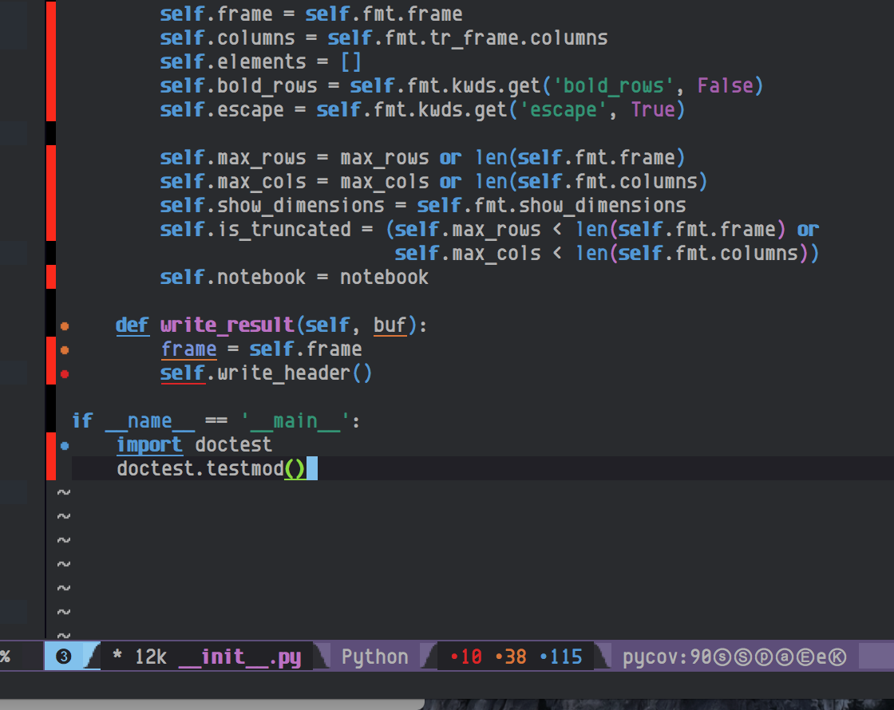

# pycoverage.el

An emacs minor mode for reporting inline on coverage stats for Python

# Dependencies

* python-coverage>=4.0

# Installation

Put something like this in your .emacs

    (require 'linum)
    (require 'pycoverage)

    (defun my-coverage ()
      (interactive)
      (when (derived-mode-p 'python-mode)
        (progn
          (linum-mode)
          (pycoverage-mode)
          )
        )
      )

I like to create a per project virtualenv. Use pip to install cov2emacs
in that virtualenv.

    $ source path/to/env/bin/activate
    (env) $ cd pycoverage.el/cov2emacs
    (env) $ pip install .

Use pyvenv mode to activate your virtualenv and you should be good to go.

# Running

There should be ``.coverage`` file in the directory of the module you
want coverage reporting on (or the parents of that directory).
Note that if your file has been modified later than the .coverage file, it
will be considered as stale and ignore it.

   M-x pycoverage-mode

If there is a ``.coverage`` file in the directory (or a parent) of the
source file, the mode will try to use it for coverage information.  Red highlights
mean that lines were missed (Coverage percent for file is in mode
line).

The mode-line should have one of the following updates:

* ``pycov(...)`` - Tool is running
* ``pycov:NUM%`` - Percentage covered. Should see red in fringe where coverage is missing
* ``pycov(OLD)`` - ``.coverage`` file is older than current buffer. Re-gen ``.coverage`` (ie by running tests with coverage turned on.) Run ``pycoverage-refresh`` to update coverage results
* ``pycov(Err:no .coverage file)`` - There is no ``.coverage`` file. Re-gen ``.coverage`` (ie by running tests with coverage turned on.) Run ``pycoverage-refresh`` to update coverage results

# Links

Forked from:

    https://github.com/mattharrison/pycoverage.el
